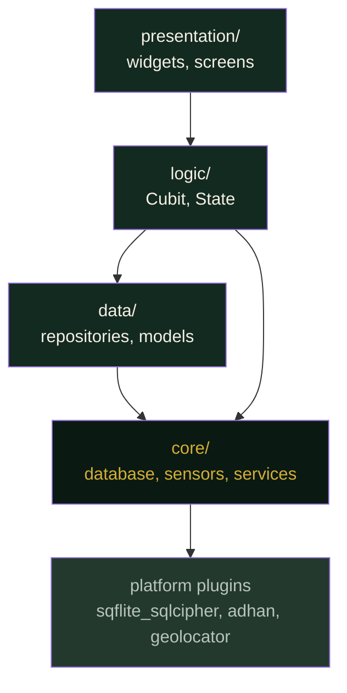

# noor (نور) — System Architecture

**Status:** Reconstructed from project history, 5 August 2026. Mermaid
diagram and ADRs below are carried from the original document's retained
record.

---

## 1. Architectural style

Feature-first Clean Architecture, unidirectional dependencies. Each feature
is a vertical slice owning its own `data/`, `logic/`, `presentation/`.
Features never import from one another; anything shared moves down into
`core/`.

### 1.1 The dependency rule

Arrows point in one direction only. No cycles, no upward calls.

---

## 2. Architecture Decision Records

**ADR-1 — Feature-first over layer-first.**
Layer-first (`screens/`, `services/`, `models/`) scatters a single feature
across the tree and makes deletion risky. Feature-first keeps a slice
self-contained. *Accepted.*

**ADR-2 — Cubit over Bloc by default.**
Most interactions are simple state transitions; named events add ceremony
without clarity. Bloc reserved for genuinely event-driven features.
*Accepted.*

**ADR-3 — No INTERNET permission.**
Stronger than a policy commitment: the OS denies the capability, so the
privacy claim is structural, not behavioural. Costs the ability to ever
fetch corrections or updates — accepted deliberately. *Accepted.*

**ADR-4 — Delegate prayer math to the `adhan` package.**
Bespoke astronomical math is a liability in a worship app. An established,
reviewed implementation is safer than anything written from scratch.
*Accepted.*

**ADR-5 — Quran text as a verified bundled asset, never generated.**
The single most important decision in the project. Checksum verification
makes corruption detectable rather than silent. *Accepted.*

**ADR-6 — Append Gradle overrides rather than edit in place.**
Determined empirically after repeated build failures: Flutter's own
migration step discards in-place edits to `build.gradle.kts`. *Accepted.*

**ADR-7 — Splash behind a single config switch.**
The launch animation touches religious text (Bismillah); a one-line
reversal path (`cosmicEnabled = false`) is a requirement, not a
convenience. *Accepted.*

---

## 3. Known architectural debt

| Item | Severity | Traces to |
|---|---|---|
| DB passphrase is a placeholder, not Keystore-backed | **Blocker** | `PV-3` |
| No automated tests beyond Tasbih | High | `VT-1` unmet |
| Debug signing only | **Blocker for release** | `BR-1` |
| INTERNET permission not yet removed | **Blocker** | `PV-1` |
| `allowBackup` not yet disabled | **Blocker** | `PV-2` |
| Architecture guards in CI are advisory, not blocking | Medium | — |
| Only Tasbih is human-verified; other features are written, unexecuted code | High | — |
| Tamil/Sinhala Hajj/Umrah religious text has no licensed source | Blocked | `DS-2` |

These four blockers (passphrase, signing, INTERNET permission, allowBackup)
are what stand between the current debug APK and a Play Store submission.
